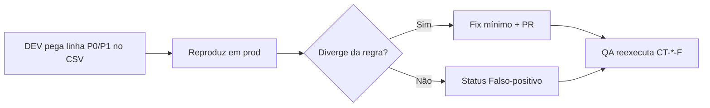

# Retorno QA → DEV sênior (rodada 2 · produção)

**Para:** time de desenvolvimento  
**De:** QA sênior (execução automatizada + triagem TL)  
**Data:** 2026-09-22  
**Ambiente testado:** https://orbe-seven.vercel.app  
**Deploy de referência:** merge PR #143 em `master`

---

## 1. O que analisar

| Pacote | Conteúdo |
| --- | --- |
| [`DEV-BACKLOG-FAIL-RODADA-2.csv`](./DEV-BACKLOG-FAIL-RODADA-2.csv) | **253 linhas** — cada `FAIL` do cenário **Feliz** com prioridade sugerida e colunas para vocês preencherem |
| [`relatorio-feliz-prod-rodada-2.csv`](./relatorio-feliz-prod-rodada-2.csv) | Relatório bruto (PASS/FAIL/BLOQUEADO) |
| [`relatorio-feliz-prod-rodada-2.html`](./relatorio-feliz-prod-rodada-2.html) | Mesmo dado em HTML |
| `prod-rodada-2/*.json` | Evidência por tela (12 arquivos) |
| [`RELATORIO-QA-RODADA-2.md`](./RELATORIO-QA-RODADA-2.md) | Comparativo com rodada 1 |
| [`AUDITORIA-AMOSTRA-FAIL.md`](./AUDITORIA-AMOSTRA-FAIL.md) | Por que muitos FAIL são **falso-positivo** do runner |

**Não é fila de DEV (sem correção de código por padrão):** **130 BLOQUEADO** — exigem login ou dado de catálogo; QA reexecuta com pré-condição.

---

## 2. Resumo numérico (rodada 2)

| Resultado | Qtd | Ação DEV |
| --- | ---: | --- |
| PASS | 128 | Nenhuma |
| **FAIL** | **253** | **Este documento + backlog CSV** |
| BLOQUEADO | 130 | QA / ambiente de teste |

### FAIL por tela (ordem sugerida de ataque)

| Tela | FAIL | Dono sugerido |
| --- | ---: | --- |
| 03-SERIES | 38 | Listagem + API séries |
| 01-HOME | 37 | Home / carrosséis |
| 06-PROMOCOES | 30 | Promoções |
| 02-FILMES | 29 | Listagem filmes |
| 12-OUTRAS-TELAS | 28 | Rotas secundárias |
| 09-BUSCA-HEADER | 19 | Header / busca |
| 05-JOGOS | 18 | Jogos |
| 08-MODAIS | 18 | Modais |
| 04-ANIMES | 12 | Animes |
| 10-MINHA-LISTA | 12 | Auth + lista |
| 11-AUTH-PERFIL | 7 | Auth |
| 07-HOJE | 5 | Página Hoje |

---

## 3. Regras de correção (obrigatório)

1. **Só corrigir o que reproduzir manualmente** seguindo o cenário Feliz (`CT-*-F` em `cenarios-teste-camadas.csv`) — não “consertar” keyword do runner.
2. **Diff mínimo** — cada mudança com motivo ligado a `ID_Regra` ou bug E2E comprovado.
3. **Proibido** neste ciclo: biblioteca nova; herança de classe para “reaproveitar”; strings fake só para passar QA automático.
4. Ao fechar item no backlog: preencher `Status_DEV` = `Corrigido` \| `Falso-positivo` \| `Não aplicável`, `PR_Commit`, `Responsavel`.
5. TL DEV audita com [`DEV-CORRECOES-TL-AUDITORIA.md`](./DEV-CORRECOES-TL-AUDITORIA.md).

---

## 4. Fluxo recomendado



1. Começar por **P0** e **P1** no `DEV-BACKLOG-FAIL-RODADA-2.csv`.
2. Dividir telas entre devs (tabela §2).
3. Após PRs em `master`, QA roda:

```bash
python3 docs/regras-negocio/scripts/executar-feliz-multitask.py prod-rodada-3
python3 docs/regras-negocio/scripts/merge-execucao-producao.py prod-rodada-3
```

---

## 5. Contexto do merge #143 (já em prod)

Correções já entregues (não repetir): copy **Em alta**, `aria-label`, persistência modo anime, bootstrap home, ordem drawers Filmes/Séries, metadata SEO.  
Os **253 FAIL** restantes são em grande parte **interação/dado** não cobertos pelo runner — DEV não deve inflar código sem reprodução humana.

---

## 6. Contato / dúvida de regra

- Texto da regra: `docs/regras-negocio/regras-negocio-qa.md` ou CSV homônimo.
- Cenário Feliz completo: `docs/regras-negocio/cenarios-camadas/cenarios-teste-camadas.csv` (filtrar `Camada_Testagem = Feliz`).

*Documento gerado para handoff QA → DEV; atualizar o CSV conforme o time progride.*
