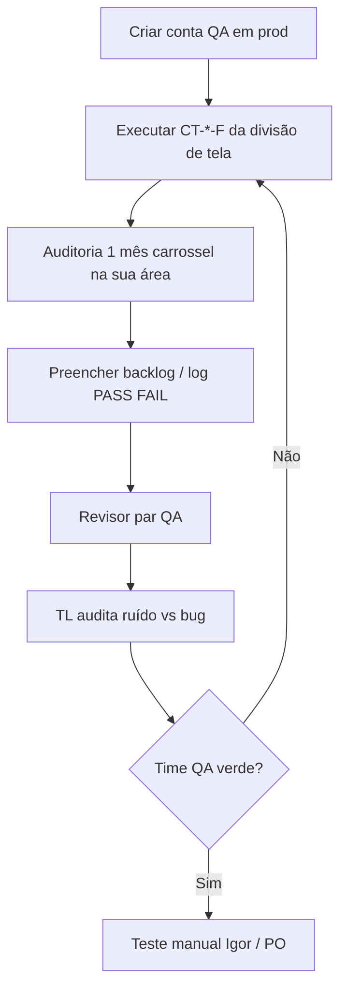

# Playbook QA sênior — execução em equipe (antes do teste manual do PO)

**Versão:** 1.0 · **2026-09-22  
**Produção:** https://orbe-seven.vercel.app  
**Ordem de gate:** QA time (cenários Feliz + carrossel) → **só então** teste manual do Igor / PO.

---

## 1. Contas de teste (sem e-mail de confirmação)

O produto **não envia e-mail de confirmação** no cadastro. Cada QA sênior:

1. Cria **a própria conta** em produção (Inscreva-se) com e-mail que o QA controla (pode ser alias do time).
2. **Não** commitar senhas no repositório; registrar só “conta QA-N criada em DATA” no canal interno do time.
3. Usar a mesma conta para cenários **Feliz** que exigem login (`10-MINHA-LISTA`, `11-AUTH-PERFIL`, pins, continuar assistindo, etc.).
4. Atualizar execução: onde o runner marcou `BLOQUEADO` por “sessão anônima”, reexecutar **manual** ou com script após login.

Isso destrava a maior parte dos **~24 BLOQUEADO** por auth e vários FAIL de interação em conta.

---

## 2. Auditoria obrigatória — 1 mês do carrossel (Filmes)

Além dos `CT-*-F` da planilha, **cada QA** que pegar a tela **Filmes** (home e/ou `/filmes`) deve:

### Escopo mínimo

| Item | O quê |
| --- | --- |
| **Janela** | **Pelo menos 1 mês civil** visível no carrossel da home (faixa Filmes) — ex.: rolar até fixar um mês (ex. “Março 2026”) e listar **todos os títulos** exibidos naquele mês. |
| **Registro** | Planilha ou bloco no relatório da tela: `Título` · `Data no card` · `Deve estar? (S/N)` · `Motivo (regra RN-*)` · `Evidência (print ou ID)` |
| **Critério “deve estar?”** | Usar inventário `regras-negocio-qa.md` / CSV — curadoria, em cartaz, duração na home, nota com muitos votos, etc. |
| **Fora do lugar** | Se o título **não** deveria aparecer → marcar **FAIL de produto** com `ID_Regra` (ex. `RN-FILMES-041`); se **deveria** e não está → idem. |

### Repetir por mídia (divisão do time)

| QA (preencher nome) | Faixa / rota | Mês auditado |
| --- | --- | --- |
| | Home — carrossel **Filmes** | |
| | Home — **Séries** (1 mês) | |
| | Home — **Animes** (1 temporada ou mês, conforme modo) | |
| | Home — **Jogos** (1 mês ou “em alta”, conforme regra) | |

**Mínimo do time:** pelo menos **1 mês de Filmes** auditado por **cada** QA que tiver lote Filmes/Home; TL consolida sem duplicar o mesmo mês.

### Modelo de linha (copiar para Excel/Notion)

```
Mês: 2026-03 | Tela: Home > Filmes | Título: Exemplo | Data card: 2026-03-15 | Deve estar: N | Regra: RN-FILMES-041 | Notas: nota baixa com muitos votos | Print: ...
```

---

## 3. Ordem de execução (time QA)



1. **Feliz** por `ID_Cenario` (`cenarios-teste-camadas.csv`, camada Feliz).
2. **Auditoria de carrossel** (§2) — não substitui o Feliz; complementa regras de curadoria.
3. **Negativo + Exploratório** conforme pacote camadas, após Feliz da mesma área.
4. Só com **consenso TL** “rodada do time OK” → avisar PO para teste manual.

---

## 4. O que registrar

| Artefato | Quem |
| --- | --- |
| `relatorio-feliz-prod-rodada-*.csv` / JSON em `execucao/` | Runner + complemento manual |
| `DEV-BACKLOG-FAIL-RODADA-2.csv` — colunas `Status_DEV`, evidência | QA marca; DEV só entra em bug confirmado |
| **Anexo:** `QA-AUDITORIA-CARROSSEL-<TELA>-<MES>.csv`** (criar por QA) | Lista de títulos do mês |
| TL: [`QA-TL-RUIDO-VS-BUG.md`](./QA-TL-RUIDO-VS-BUG.md) | Separação oficial |

---

## 5. Referências

- Cenários: `cenarios-teste-camadas.csv` · `generated/*.md`
- Retorno DEV: [`DEV-RETORNO-QA-FAIL.md`](./DEV-RETORNO-QA-FAIL.md)
- Processo geral: `../QA-PROCESSO-CENARIOS.md` (pasta `regras-negocio`)
